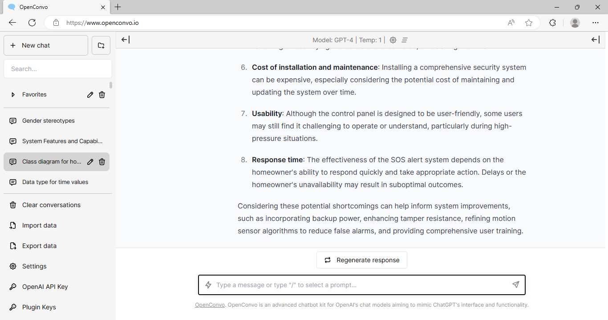
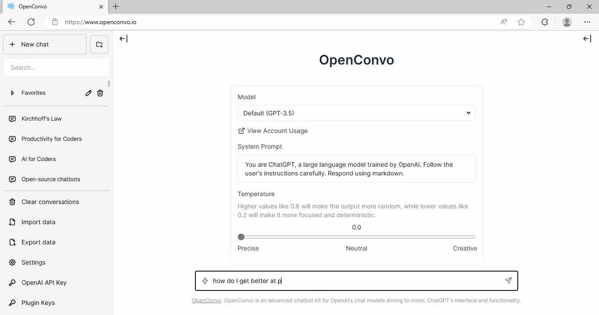
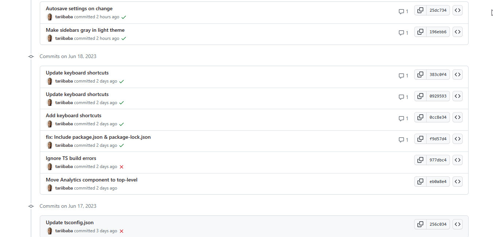
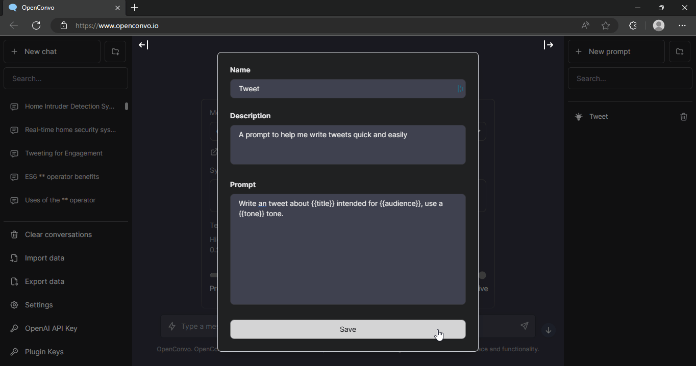

# OpenConvo

OpenConvo is a 🎨creative open-source AI chatbot.🤖 Swiftly & efficiently conquer tasks🏃‍♂️, revolutionize your world🌐, and level up with AI magic.

## Why OpenConvo over ChatGPT??

### **Save cash with pay as you go**

Why pay $20 per month for what you'll probably never use? Just set your OpenAI key and start paying for only what you use.
Spend dimes and cents don't spend $20!

### **Open-source chatbot**

OpenConvo is an open-source chatbot with superb customization! Enjoy its community-driven development for continuous improvement & evolution✨ based on user feedback.

### **Prompt collection**

Boost productivity!

Store your frequent & essential prompts right in the chatbot for quick & easy access. Craft your message in no time and gain precise answers.

## Updates

OpenConvo will be continuously receive more powerful updates over time.

Expect frequent improvements.

## Contact

If you have any questions, feel free to reach out to Tari Ibaba on [Twitter](https://twitter.com/Tari_Ibaba).

## Credit

- [ChatbotUI](https://github.com/mckaywrigley/chatbot-ui)
